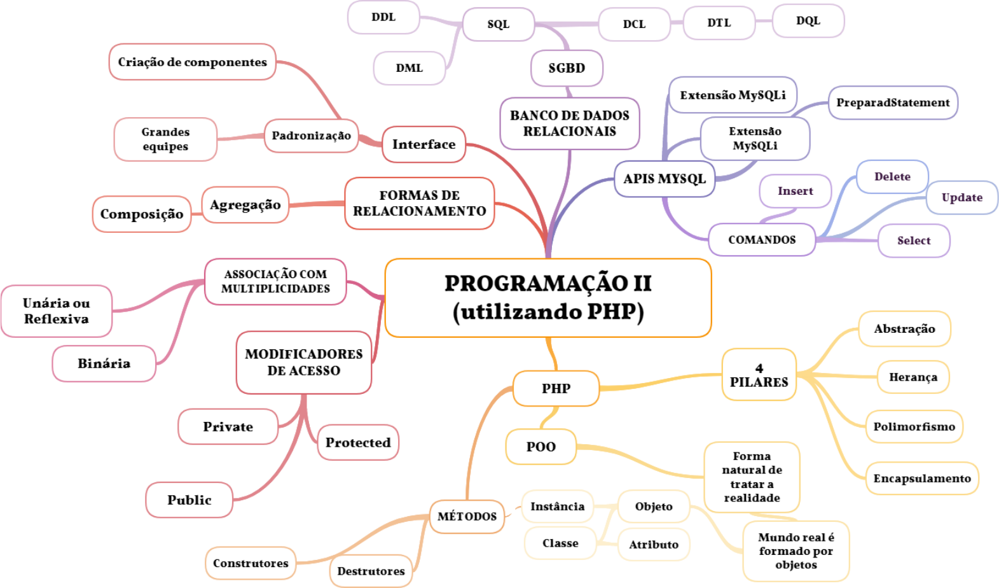

<h2 align="center"> Linguagens de Programação II</h2>

<h3 style="color: black;" align="center"> Professor(a): Fernanda Maria Ribeiro</h3>

<h3 style="color: black;" align="center"> Mapa Conceitual</h3>

<h3 style="color: black;"> Resumo</h3>

Lorem ipsum dolor sit amet, consectetur adipiscing elit, sed do eiusmod tempor incididunt ut labore et dolore magna aliqua. Aliquam ut porttitor leo a diam. Erat nam at lectus urna duis convallis convallis tellus id. Pellentesque elit eget gravida cum sociis natoque penatibus et magnis. Ultrices vitae auctor eu augue ut lectus arcu. Morbi tristique senectus et netus et malesuada. Turpis tincidunt id aliquet risus feugiat in ante. Consequat interdum varius sit amet mattis vulputate enim nulla. Felis eget nunc lobortis mattis aliquam. Eu non diam phasellus vestibulum lorem sed risus. A condimentum vitae sapien pellentesque habitant morbi tristique. Orci dapibus ultrices in iaculis nunc sed augue lacus viverra. Proin sagittis nisl rhoncus mattis rhoncus urna neque. Dictum varius duis at consectetur lorem donec massa sapien. Blandit cursus risus at ultrices mi tempus imperdiet. Laoreet sit amet cursus sit amet dictum sit amet justo. Felis eget nunc lobortis mattis aliquam faucibus. Nam aliquam sem et tortor consequat.

<h3 style="color: black;"> Materiais de Estudo</h3>

- PDFs/Slides:
  - [Aula 1.0 - Apresentação](https://presencial.muz.ifsuldeminas.edu.br/mod/resource/view.php?id=386342)
  - [Aula 2.0 - POO](https://presencial.muz.ifsuldeminas.edu.br/mod/resource/view.php?id=391983)
  - [Aula 3.0 - Herança](https://presencial.muz.ifsuldeminas.edu.br/mod/resource/view.php?id=391984)
  - [Aula 3.1- Herança/UML](https://presencial.muz.ifsuldeminas.edu.br/mod/resource/view.php?id=391985)
  - [Aula 3.2 - JAVA](https://presencial.muz.ifsuldeminas.edu.br/mod/resource/view.php?id=393705)
  - [Aula 3.3 - Python](https://presencial.muz.ifsuldeminas.edu.br/mod/resource/view.php?id=394855)
  - [Aula 4.0 - Composição](https://presencial.muz.ifsuldeminas.edu.br/mod/resource/view.php?id=394856)
  - [Aula 5.0 - Polimorfismo](https://presencial.muz.ifsuldeminas.edu.br/mod/resource/view.php?id=397733)
  - [Aula 6.0 - Classes Abstratas](https://presencial.muz.ifsuldeminas.edu.br/mod/resource/view.php?id=398220)
  - [Aula 7.0 - Interfaces](https://presencial.muz.ifsuldeminas.edu.br/mod/resource/view.php?id=398683)
  - [Aula 8.0 - Tratamento Exceções](https://presencial.muz.ifsuldeminas.edu.br/mod/resource/view.php?id=398682)

- Vídeos:
  - N/D.

- Complementares:
  - N/D.

<h3 style="color: black;"> Atividades</h3>

- Questionários:
  - [Primeiro Questionário](https://presencial.muz.ifsuldeminas.edu.br/mod/quiz/view.php?id=394750)
  - [Questionário Final](https://presencial.muz.ifsuldeminas.edu.br/mod/quiz/view.php?id=398661)

- Lista de Exercícios:
  - [Códigos em Sala 3 - Herança](https://presencial.muz.ifsuldeminas.edu.br/mod/resource/view.php?id=398221)  -  [Link para envio](https://presencial.muz.ifsuldeminas.edu.br/mod/assign/view.php?id=395408)
  - [Códigos em Sala 4 - Polimorfismo](https://presencial.muz.ifsuldeminas.edu.br/mod/resource/view.php?id=398511)  -  [Link para envio](https://presencial.muz.ifsuldeminas.edu.br/mod/assign/view.php?id=395408)
  - [Códigos em Sala 5 - Exceções](https://presencial.muz.ifsuldeminas.edu.br/mod/resource/view.php?id=398684)  -  [Link para envio](https://presencial.muz.ifsuldeminas.edu.br/mod/assign/view.php?id=395408)

<h3 style="color: black;"> Colab</h3>

Seção voltada para a colaboração entre os alunos.

Links abertos com resumos, anotações e materiais de revisão.
